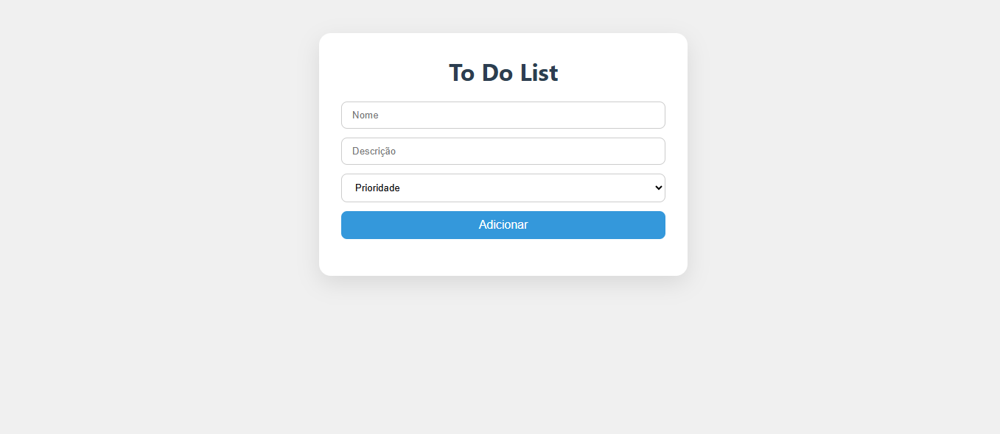

# 💰 Lista de tarefas

Projeto de sistema para gerenciamento de tarefas **To-do-list** com algumas funcionalidades. este projeto simula as principais operações para uma organização maior de suas tarefas.

---

## 🚀 Funcionalidades

- ✅ Cadastrar tarefa
- 💸 Descrição da tarefa
- 🏦 Prioridade da tarefa

---

## 🛠️ Tecnologias Utilizadas

### Back-end:
- Spring Web
- 
### Front-end:
- HTML5
- CSS3
- JavaScript (puro)
  

